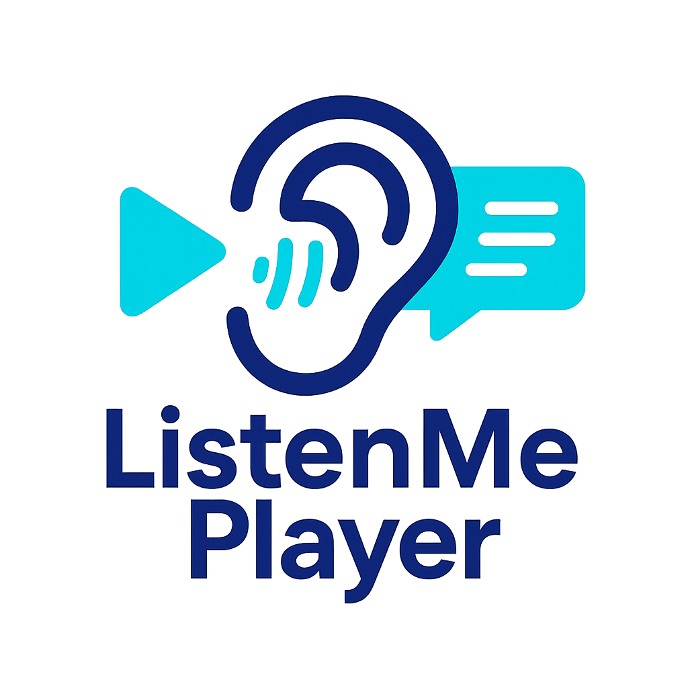
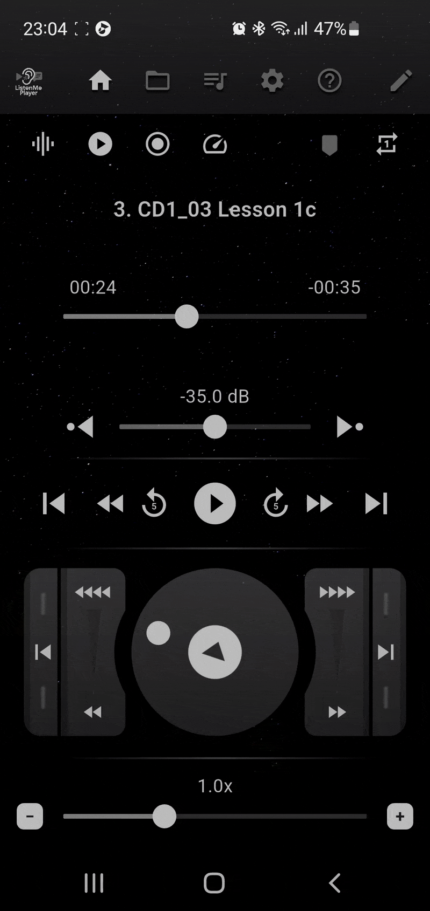
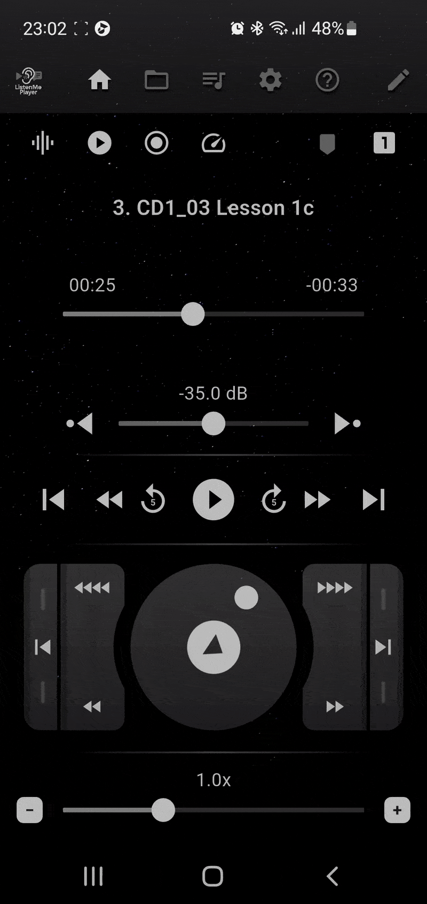
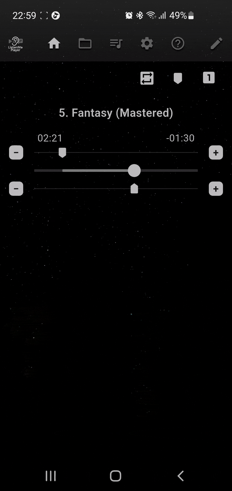
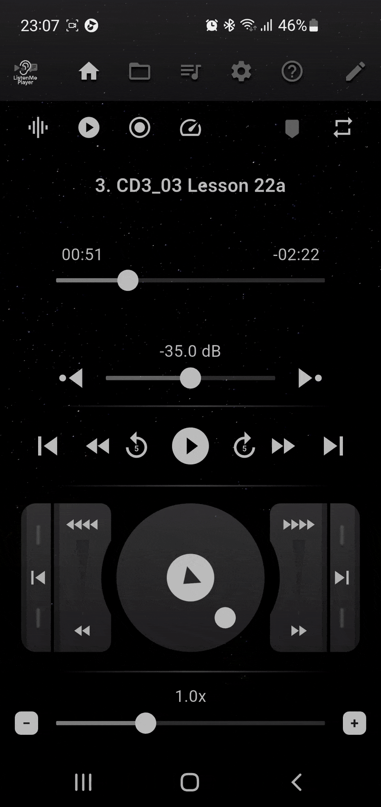

  

<h1 align="center">ListenMe Player — Open Edition</h1>

  Advanced Flutter audio player for language learners, podcasters, and offline listening. 
  Precision navigation • Silence analysis • Fully customizable UI

  <!-- Badges -->
  
  
  
  

---

**ListenMe Player** is an advanced audio player built with Flutter, designed for language learners, podcasters, interview transcribers, and everyone who prefers listening to audio offline.  
The application combines precise navigation tools, silence analysis, and deeply customizable UI.

This repository contains an **open (reduced) edition** of the project.  
Some private modules (premium logic, ads, Firebase configuration, service keys) are intentionally excluded.

> 🎯 **Goal of the Open Edition**  
> To showcase architecture design, UI/UX decisions, audio processing techniques,  
> and the engineering approach behind building a complex Flutter-based audio player.

## ✨ Features

<table> 
  <tr> 
    <!-- Левая колонка (фичи) --> 
    <td style="vertical-align: top; width: 60%"> 
      <h3>🎧 Playback & Navigation</h3> 
      <ul> 
        <li>Segment playback between markers with fine adjustment</li> 
        <li>Jump between silence regions</li> 
        <li>Playback with skip functions and smooth scrubbing</li> 
        <li>Jog wheel with precise rewind buttons (continuous speed control)</li> 
        <li>Fully configurable playback speed</li> 
      </ul> 
      <h3>🔍 Silence & PCM Analysis</h3> 
      <ul> 
        <li>Local audio analysis</li> 
        <li>PCM level map generation</li> 
        <li>Silence detection</li> 
        <li>Adjustable silence threshold</li> 
        <li>Real-time loudness visualization</li> 
      </ul> <h3>🎛 UI Customization</h3> 
      <ul> 
        <li>Full theme editor</li> 
        <li>Adjustable colors, gradients, and shadows</li> 
        <li>Configurable widget layout with drag-and-drop</li> 
        <li>Customizable speed ranges (playback + seek)</li> 
        <li>Background image support</li> </ul> <h3>📁 Playlists</h3> 
      <ul> <li>Folder-based playlist with subfolder navigation</li> 
        <li>Manual playlist with drag-and-drop reordering</li> <li>Audio tag metadata parsing</li> 
        <li>Persistent playlist source memory</li> 
        <li>Playback modes: singleOnce, singleLoop, playlistOnce, playlistLoop, shuffle</li> 
      </ul> 
      <h3>💾 Cache</h3> 
      <ul> <li>Adjustable cache size</li> 
        <li>Custom retention time</li> 
        <li>Clear cache function</li> 
      </ul> 
      <h3>🎚 Equalizer</h3> 
      <ul> 
        <li>Full equalizer with presets</li> 
        <li>Custom user-defined settings</li> 
      </ul> 
      <h3>📖 Help</h3> 
      <ul> 
        <li>Built-in help section describing each UI element and screen</li> 
      </ul> 
    </td> <!-- Правая колонка (GIF) --> 
    <td style="vertical-align: top; text-align: center; width: 40%"> 
      <table>
        <tr>
          <td align="center">
            <h3>Jog</h3>
            
          </td>
          <td align="center">
            <h3>Markers</h3>
            
          </td>
        </tr>
        <tr>
          <td align="center">
            <h3>Screen edit</h3>
            
          </td>
          <td align="center">
            <h3>Playlist</h3>
            
          </td>
        </tr>
      </table>
    </td> 
  </tr> 
</table>

## 🧱 Architecture

State models:

- **AppModel** — root coordinator
- **PlaybackModel** — playback & JustAudio integration
- **PlaylistModel** — playlist and source management
- **AudioToLevelsModel** — PCM & silence analysis
- **AppThemeColors** — theming system
- **DisplayWidgetConfig** — UI layout configuration

Modular UI:

- **widgets/** — jog wheel, sliders, control panels
- **ui/** — app screens
- **utils/** — helpers
- **l10n/** — localization
- **assets/** — images and backgrounds

---

## ⚠️ Open Edition Status

Some commercial and confidential modules (monetization, ads, Firebase configs)  
are **not included** in this public version.

This means the project **may not compile** as a fully functional app.  
The purpose of the repository is to demonstrate **architecture and UI**,  
not to provide a production-ready build.

---

## 🗣 Feedback

If you have questions about the architecture, audio processing, state management, or UI,  
feel free to open an **Issue** or start a **Discussion** in the repository.

---

## 📲 Install the App

You can install the full application on Google Play:

